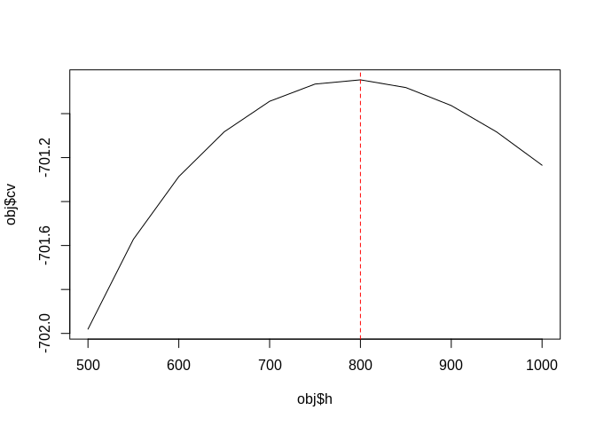
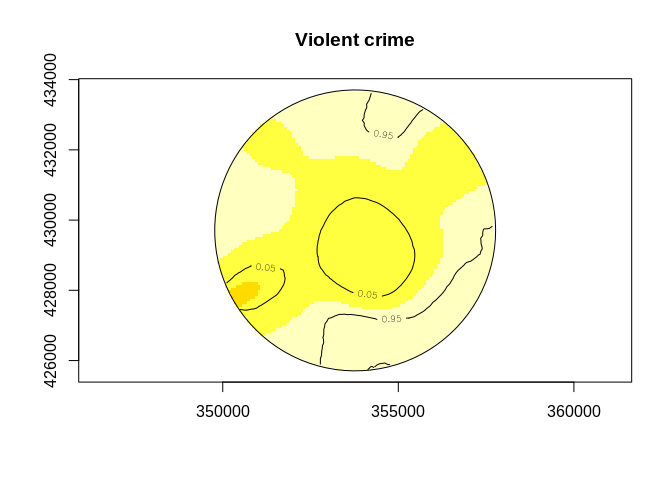
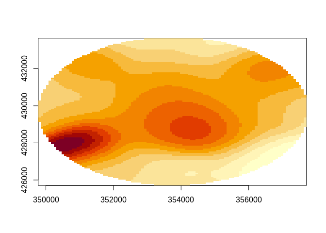
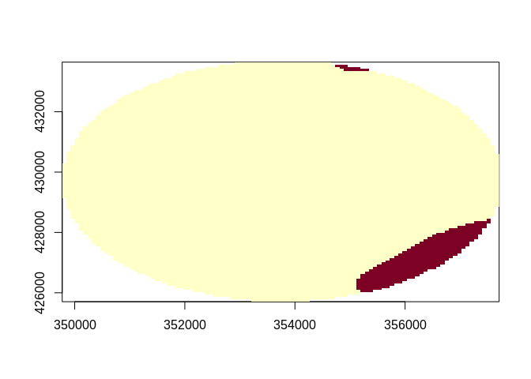
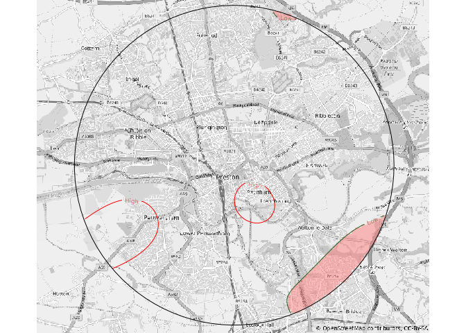

Spatial Analytics Assignment 4
================
Johan Horsmans
2/26/2021

``` r
knitr::opts_chunk$set(echo = TRUE)
```

# Task 1: Bandwidth selection

We can get a more principled measure of the violent crime ratio using a
spatial segregation model. The `spatialkernel` package implements the
theory of spatial segregation (Reardon and O’Sullivan 2004).

The first step is to compute the optimal bandwidth for kernel smoothing
under the segregation model. A small bandwidth would result in a density
that is mostly zero, with spikes at the event locations. A large
bandwidth would flatten out any structure in the events, resulting in a
large “blob” across the whole window. Somewhere between these extremes
is a bandwidth that best represents an underlying density for the
process.

`spseg()` will scan over a range of bandwidths and compute a test
statistic using a cross-validation method. The bandwidth that maximizes
this test statistic is the one to use. The returned value from `spseg()`
in this case is a list, with `h` and `cv` elements giving the values of
the statistic over the input `h` values. The `spatialkernel` package
supplies a `plotcv` function to show how the test value varies. The
`hcv` element has the value of the best bandwidth. For more information,
see [link](https://rdrr.io/cran/seg/man/spseg.html)

## Instructions

  - Install `spatialkernel` package from Github.
  - Ensure that `spatstat` is loaded and the `preston_crime` object is
    read in (check last tutorial).
  - Set `h`, the bandwidth values to try, then call `spseg(`).
  - You need to provide the start value, 500, then end value, 1000, and
    the step size, 50.
  - Assign the result to `bw_choice`.
  - Plot the test statistic vs. the bandwidth.
  - Call `plotcv()` on `bw_choice`.
  - Highlight the best bandwidth by adding a vertical line where the
    test statistic is maximized.

<!-- end list -->

``` r
# Install spatialkernel (the CRAN version is outdated, so you need to grab the most recent maintained version from Github). You may need to install.packages("devtools") and then run:
#devtools::install_github("becarioprecario/spatialkernel")

# Libraries
library(spatstat)
```

    ## Loading required package: spatstat.data

    ## Loading required package: nlme

    ## Loading required package: rpart

    ## 
    ## spatstat 1.64-1       (nickname: 'Help you I can, yes!') 
    ## For an introduction to spatstat, type 'beginner'

    ## 
    ## Note: spatstat version 1.64-1 is out of date by more than 10 months; we recommend upgrading to the latest version.

``` r
library(spatialkernel)
```

    ## 
    ## This is spatialkernel 0.4-24

    ## 
    ## Attaching package: 'spatialkernel'

    ## The following object is masked from 'package:spatstat.data':
    ## 
    ##     lansing

``` r
# Data
preston_crime <- readRDS("data/pcrime-spatstat.rds")

# Scan from 500m to 1000m in steps of 50m
bw_choice <- spseg(
    preston_crime, 
    h = seq(500, 1000, by = 50),
    opt = 1)
```

    ## 
    ## Calculating cross-validated likelihood function

``` r
# Plot the results and highlight the best bandwidth
plotcv(bw_choice); abline(v = bw_choice$hcv, lty = 2, col = "red")
```

<!-- -->

``` r
# Print the best bandwidth
print(bw_choice$hcv)
```

    ## [1] 800

Amazing\! Now you know the optimal smoothing parameter, you can do some
kernel smoothing simulations.

# Task 2: Segregation probabilities

The second step is to compute the probabilities for violent and
non-violent crimes as a smooth surface, as well as the p-values for a
point-wise test of segregation. This is done by calling `spseg()` with
`opt = 3` and a fixed bandwidth parameter `h`.

Normally you would run this process for at least 100 simulations, but
that will take too long to run here. Instead, run for only 10
simulations. Then you can use a saved object `seg` which is the output
from a 1000 simulation run that took about 20 minutes to complete.

## Instructions

  - Ensure the `preston_crime` points data is loaded.
  - You can also get the optimum bandwidth from the `hcv` element of
    `bw_choice`.
  - Set the bandwidth parameter h.
  - Run the function for 10 simulations only via the `ntest` parameter.
  - The output consists of probability maps for each class in the marks
    of the data. Plot the map for the violent crimes. Add “Violent
    crime” as the title to your plots.

<!-- end list -->

``` r
# Set the correct bandwidth and run for 10 simulations only
seg10 <- spseg(
    pts = preston_crime, 
    h = bw_choice$hcv,
    opt = 3,
    ntest = 10, 
    proc = FALSE)
# Plot the segregation map for violent crime
plotmc(seg10, "Violent crime")
```

<!-- -->

``` r
# You can modify the script above to run 1000 simulations if you have 20 mins of time. Alternatively, load the 'seg' object from data/.
seg <- readRDS("data/seg.rds")
# Plot seg, the result of running 1000 simulations
plotmc(seg, "Violent crime")
```

<!-- -->

Good work\! The simulation shows that crime is relatively more violent
in the town centre and South Western edge.

# Task 3: Mapping segregation

With a base map and some image and contour functions we can display both
the probabilities and the significance tests over the area with more
control than the `plotmc()` function.

The `seg` object is a list with several components. The X and Y
coordinates of the grid are stored in the `$gridx` and `$gridy`
elements. The probabilities of each class of data (violent or
non-violent crime) are in a matrix element `$p` with a column for each
class. The p-value of the significance test is in a similar matrix
element called `$stpvalue`. Rearranging columns of these matrices into a
grid of values can be done with R’s matrix() function. From there you
can construct list objects with a vector `$x` of X-coordinates, `$y` of
Y-coordinates, and `$z` as the matrix. You can then feed this to
`image()` or `contour()` for visualization.

This process may seem complex, but remember that with R you can always
write functions to perform complex tasks and those you may repeat often.
For example, to help with the mapping in this exercise you will create a
function that builds a map from four different items.

The `seg` object from 1000 simulations can be loaded from data folder,
as well as the `preston_crime` points and the `preston_osm` map image.

## Instructions

  - Inspect the segregation object.
      - Use `str()` to see the structure of `seg`.
      - Set `ncol` as the length of one of the elements of `seg`.
  - Create prob\_violent as a list with
      - x as the gridx element of `seg`.
      - y as the gridy element.
      - z as a matrix with the “violent crime” column of the p element.
  - Create `p_value` as in the previous step, except that the `z`
    element is logical, and `TRUE` when the `stpvalue` element of seg is
    less than 0.05.
  - Call the `segmap()` function shown in the script to find areas where
    the probability of a crime being violent is above 0.15. Use 0.05 as
    the lower probability.

<!-- end list -->

``` r
library(raster)
```

    ## Loading required package: sp

    ## 
    ## Attaching package: 'raster'

    ## The following objects are masked from 'package:spatstat':
    ## 
    ##     area, rotate, shift

    ## The following object is masked from 'package:nlme':
    ## 
    ##     getData

``` r
# Inspect the structure of the spatial segregation object
str(seq)
```

    ## function (...)

``` r
# Get the number of columns in the data so we can rearrange to a grid
ncol <- length(seg$gridx)

# Rearrange the probability column into a grid
prob_violent <- list(x = seg$gridx,
                     y = seg$gridy,
                     z = matrix(seg$p[, "Violent crime"],
                                ncol = ncol))
# You have basically georeferenced the image within data's coordinates
image(prob_violent)
```

<!-- -->

``` r
# Rearrange the p-values, but choose a p-value threshold
p_value <- list(x = seg$gridx,
                y = seg$gridy,
                z = matrix(seg$p[, "Violent crime"]< 0.05,
                                ncol = ncol))
image(p_value)
```

<!-- -->

``` r
# Create a mapping function
segmap <- function(prob_list, pv_list, low, high){

  # background map
  library(raster)
  preston_osm <- readRDS("data/osm_preston_gray.rds")
  plotRGB(preston_osm)

  # p-value areas
  image(pv_list, 
        col = c("#00000000", "#FF808080"), add = TRUE) 

  # probability contours
  contour(prob_list,
          levels = c(low, high),
          col = c("#206020", "red"),
          labels = c("Low", "High"),
          add = TRUE)

  # boundary window
  plot(Window(preston_crime), add = TRUE)
}

# Map the probability and p-value
segmap(prob_violent, p_value, 0.05, 0.15)
```

<!-- -->

Great work\! By displaying the violent crime areas on the map, it’s
really easy to understand where the problem areas are.
